# A Multi-Agent Platform for Stock Research, Sentiment Analysis, and Forecasting

This project is an automated stock research platform that combines market data, news, social sentiment, machine learning forecasting, LLM-based interpretation, and multi-agent decision workflows in one system.

The platform is organized into several layers:

- `Detail` and `Social` as the two forecasting pipelines
- `Sentiment` as the visualization layer for sentiment data
- `Analysis` as the LLM-based interpretation layer
- `Team` as the multi-agent discussion and decision layer
- `Ops` as the automation and control layer

Rather than acting as a single black-box prediction tool, IvyTrader is designed as a full research and decision-support system that connects data collection, model training, analysis, and automated workflows.

---

## 1. Multi-Agent Framework (Team Page)

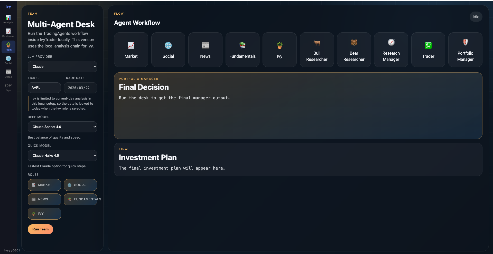

We simulate a real-world investment workflow using a structured multi-agent system, where different roles collaborate to generate more robust trading decisions.
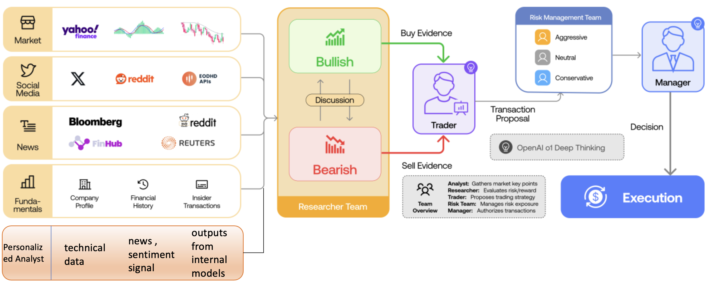

### Workflow
- **Analysts Team**  
  Five analysts collect and process market data, including technical signals, news, sentiment, and fundamentals, together with outputs from internal models. A Personalized Analyst further adapts the analysis based on ticker-specific context.

- **Research Team**  
  Aggregates and evaluates all available signals, then forms a unified bullish or bearish view through structured discussion.

- **Trader**  
  Generates trading decisions from the research output and proposes transaction strategies.

- **Risk Management Team**  
  Assesses current market risk and filters out unsafe decisions.

- **Fund Manager**  
  Reviews, approves, and executes the final trade-level conclusion.

### Collaborative Decision-Making

On the `Team` page, the user can:

- observe multiple agents analyzing the same ticker from different roles
- review each agent’s reasoning and perspective
- see a final decision synthesized in a manager-style output

From this page, the user gets:

- a multi-perspective discussion process
- diverse reasoning styles for the same asset
- a structured, consensus-driven final decision report

---

## 2. Personalized Analyst (Analysis Page)
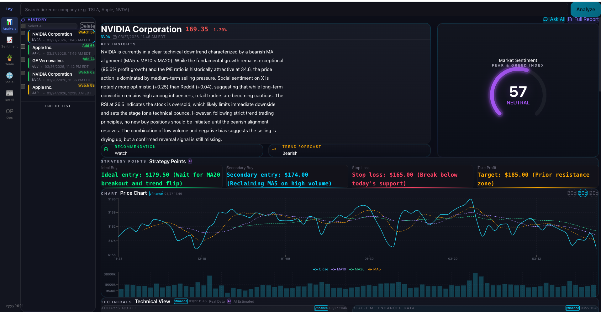

The `Analysis` page is the LLM-based interpretation layer.

It mainly reads three types of information:

- price and technical data
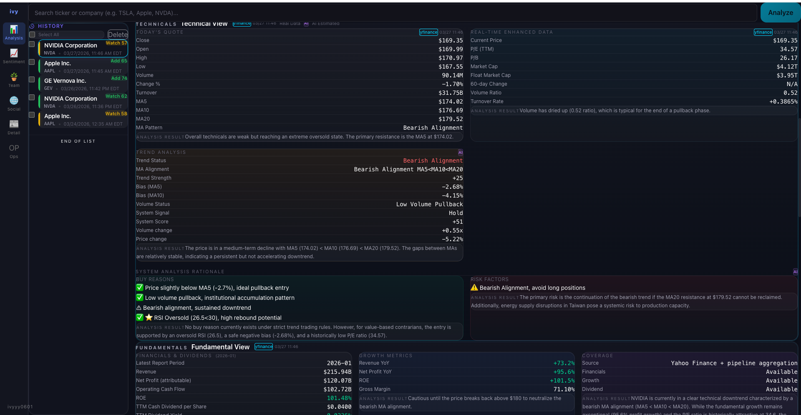

- news and sentiment signals
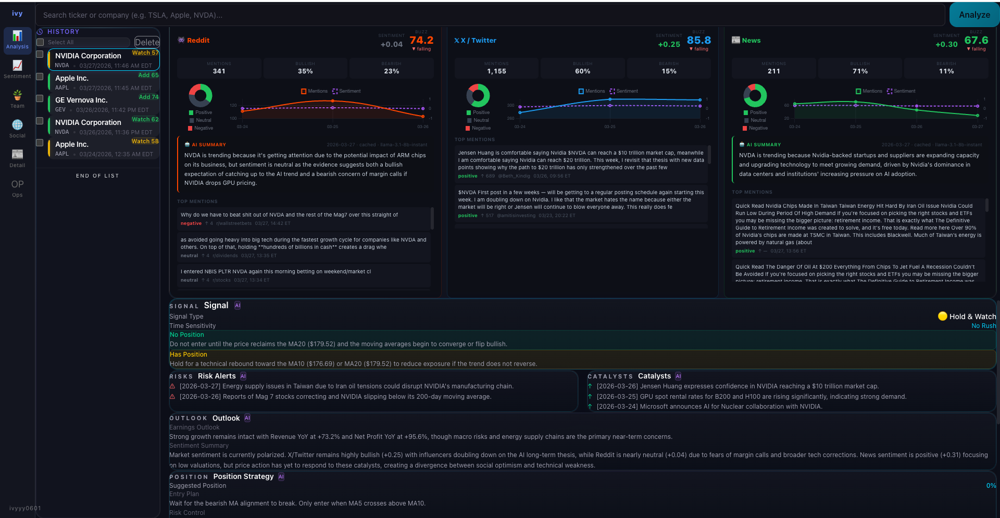

- outputs from the system’s own trained models
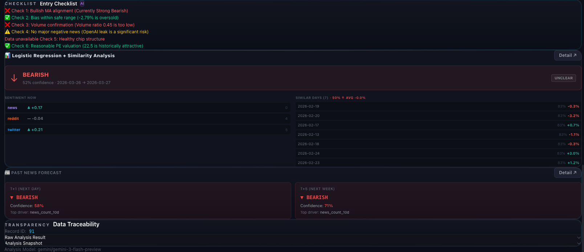

The LLM then combines these inputs into a more complete analysis report.

This page can also be adapted for different companies by incorporating company-specific context and personalized strategy logic, making the final analysis more flexible and easier to interpret.

On this page, the user can:

- review integrated stock analysis
- read research-style summaries generated from prepared system signals
- inspect outputs that combine data from multiple modules

From this page, the user gets:

- a higher-level explanation built from price, news, sentiment, and model outputs
- a research-style report instead of only a raw prediction
- a more complete view of the ticker across multiple signals

---

## 3. Forecast Pages

The platform includes two forecasting pipelines with different data sources, modeling approaches, and perspectives.

They do not rely on the same input data, and they are designed to capture different market signals. Their forecasting performance is still under active improvement.

### 3.1 Detail Page
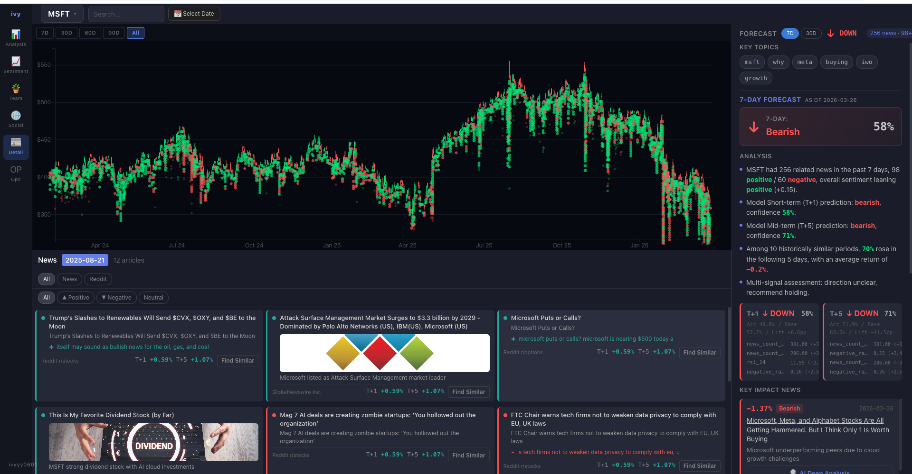

The `Detail` page is the news-driven forecasting page.

It uses:

- OHLC price data
- related news articles
- Reddit-linked content
- sentiment labels
- technical indicators
- historical similarity
- machine learning forecasts

This page focuses more on event-driven analysis. It combines market data and news context to explain what happened and to predict short-term price direction.

#### Main Features

- **News and Reddit posts on the chart**  
  Dots on the candlestick chart represent news or related content for each date. Click any dot to see what was affecting the company at that time.  
  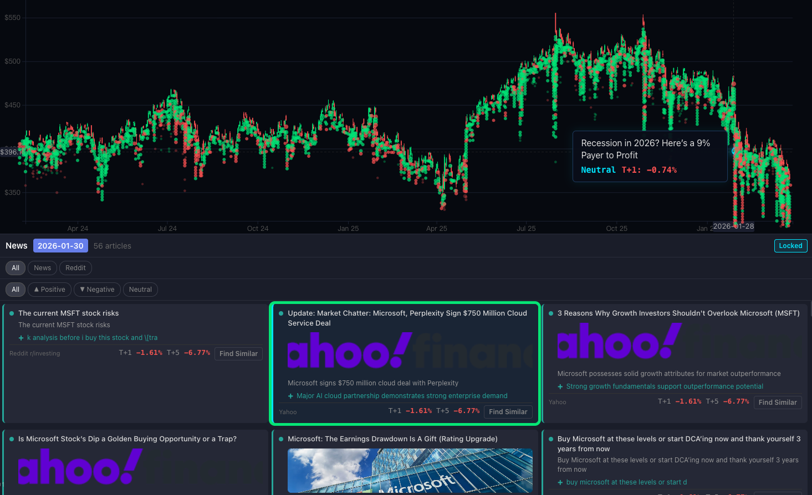

- **Day News / Range News**  
  Click a single day to inspect that day’s news, or select multiple days to review the full information flow during a specific period.
  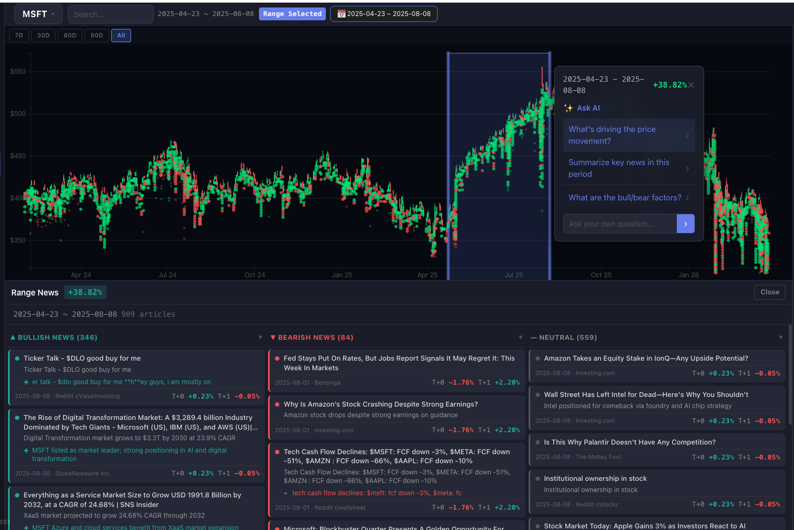

- **Find similar events**  
  The system retrieves historical periods with similar news patterns and shows what happened to the stock afterward.  
  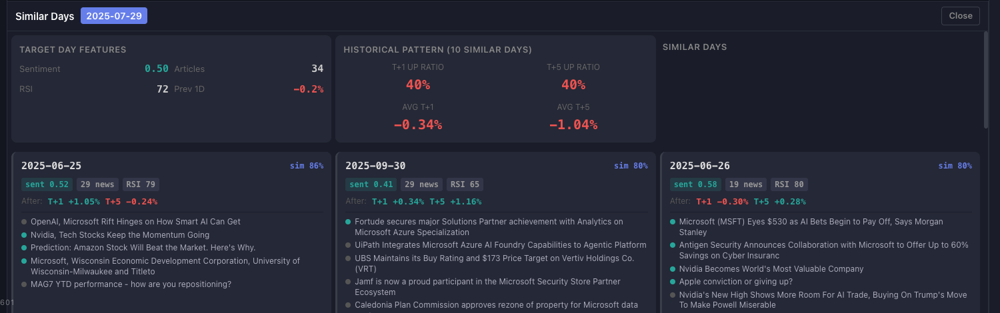

- **Ask AI to explain price moves**  
  Select a date range and ask AI why the stock rallied or dropped. It summarizes the main drivers behind the move.  
  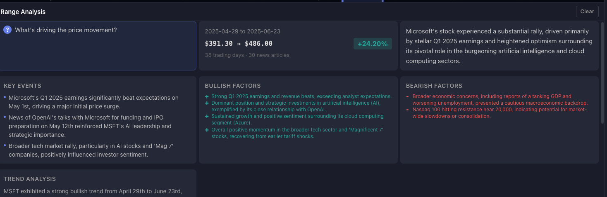

- **Predict trends**  
  Based on recent news events, sentiment, and technical signals, the model predicts short-term price direction.  

- **AI Deep Analysis**  
  Open a deeper AI explanation for a single article to understand why that specific piece of news matters.

#### On this page, the user can:

- choose a ticker
- change the chart time range
- click one day to open `Day News`
- select multiple days to open `Range News`
- use `Ask AI` to summarize a selected period
- open `AI Deep Analysis` for a single article

#### From this page, the user gets:

- price action and candlestick history
- related news and Reddit-linked content
- positive, negative, and neutral sentiment labels
- a short-term forecast with confidence
- top drivers behind the prediction
- similar historical periods and what happened afterward
- key impact news and AI-generated explanations

### 3.2 Social Page

The `Social` page is the sentiment-driven forecasting page.

It uses:

- aggregated sentiment data from News, Reddit, and Twitter
- buzz and bullishness signals across platforms
- technical indicators
- machine learning forecasts
- similarity-based historical matching

This page focuses more on market mood and sentiment structure rather than individual events.

#### Main Features

- **Cross-platform sentiment visualization**  
  View how sentiment score, buzz, and bullish ratio change over time across News, Reddit, and Twitter.

- **Short-term sentiment-driven forecast**  
  The system uses aggregated platform signals together with technical features to generate a short-term directional forecast.

- **Signal Breakdown**  
  See how the final signal is formed from the machine learning model, historical similarity, and combined decision logic.

- **Top Drivers**  
  Inspect which sentiment or technical features are pushing the result most strongly.

- **Similar Days**  
  Discover historical days with similar sentiment setups and review what happened afterward.

#### On this page, the user can:

- choose a ticker
- inspect sentiment trends over time
- compare News, Reddit, and Twitter signals
- switch between sentiment, buzz, and bullishness views
- review the forecast and confidence
- inspect top drivers and similar days

#### From this page, the user gets:

- platform-level sentiment comparison
- sentiment, buzz, and bullishness trends over time
- a short-term forecast with confidence
- the main drivers behind the signal
- similar historical sentiment setups and their outcomes

---

## 4. Sentiment Page
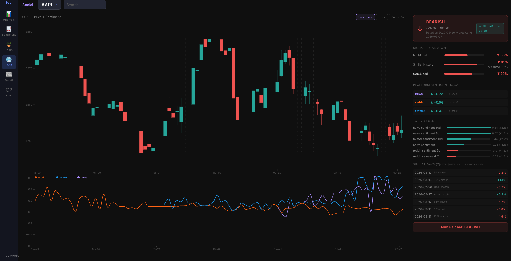

The `Sentiment` page is the visualization layer for sentiment data itself.

It focuses on:

- sentiment trends over time
- cross-platform comparison
- changes in activity and market mood across dates

This page is designed to help users understand the raw sentiment structure before moving to the forecasting pages.

#### On this page, the user can:

- inspect sentiment trends over time
- compare platforms
- review how sentiment and activity change across dates

#### From this page, the user gets:

- a direct view of sentiment behavior
- platform-level comparisons
- a cleaner understanding of how sentiment changes before looking at forecasts

---

## 5. Data Collection and Processing

The platform is built on a multi-source data pipeline that collects, cleans, aligns, and transforms raw market and text data into structured ticker-level features.

### 5.1 Data Sources

The system integrates data from multiple sources:

- **OHLC market data** for price and volume history
- **News APIs** for company-related articles and event coverage
- **RSS feeds** for real-time news ingestion
- **Reddit historical posts** for social discussion and retail sentiment
- **Aggregated platform sentiment** from News, Reddit, and Twitter

These sources are used together to capture both market behavior and information flow around each ticker.

### 5.2 Data Processing Pipeline

Raw data is not used directly. Instead, it goes through a structured processing workflow:

- **collection**  
  gather market, news, and social data from APIs and historical sources

- **cleaning**  
  remove incomplete or low-quality records and normalize fields across different sources

- **ticker relevance filtering**  
  determine whether an article or post is truly related to a specific ticker rather than just mentioning it

- **date alignment**  
  align text data, sentiment data, and OHLC data onto a consistent daily timeline

- **daily aggregation**  
  transform raw posts and articles into daily ticker-level summaries

- **feature generation**  
  create structured inputs such as sentiment, buzz, rolling statistics, momentum, and technical indicators

### 5.3 NLP and Sentiment Processing

To make text data usable in the forecasting system, the platform applies several processing layers:

- **LLM-based relevance filtering**  
  used to determine whether a piece of content is genuinely relevant to a ticker

- **FinBERT sentiment classification**  
  used to assign financial sentiment labels to articles and posts

- **Claude Batch API processing**  
  used to analyze large volumes of text more efficiently and at lower cost, while still generating structured outputs such as sentiment, summaries, and bullish/bearish reasoning

This processing pipeline converts raw text into structured research signals that can be used by both forecasting models and LLM-based analysis layers.

### 5.4 Output of the Data Pipeline

After processing, the system produces:

- aligned daily OHLC and sentiment data
- ticker-level news and social summaries
- sentiment and activity signals across platforms
- technical indicators
- structured feature sets for model training and inference

These processed outputs support the forecasting pages, the analysis workflow, and the multi-agent decision system.

---

## 6. Model Training

The platform includes two primary forecasting pipelines:

- a news-driven forecasting pipeline for the `Detail` page
- a sentiment-driven forecasting pipeline for the `Social` page

Both pipelines are trained on structured daily ticker-level data, but they differ in input emphasis, modeling logic, and forecast interpretation.

### 6.1 Detail Forecasting Pipeline

The `Detail` pipeline is designed to capture event-driven price movement.

It is trained on features built from:

- OHLC market data
- technical indicators
- related news articles
- Reddit-linked content
- processed sentiment labels
- historical event similarity

This pipeline focuses on how company-specific news and recent market context may influence short-term direction. It combines structured news features with technical features and uses machine learning to generate short-term forecasts, while also referencing similar historical periods for interpretability.

### 6.2 Social Forecasting Pipeline

The `Social` pipeline is designed to capture sentiment-driven short-term movement.

It is trained on features built from:

- aggregated sentiment from News, Reddit, and Twitter
- buzz and bullish/bearish platform signals
- rolling sentiment and momentum features
- technical indicators
- historical similarity information

During development, this pipeline was iteratively refined through:

- model comparison across different ML approaches
- parameter tuning
- feature selection and feature engineering
- confidence calibration
- similarity-based signal refinement
- threshold and signal-quality filtering

Rather than relying purely on one raw model output, the final signal is designed as a structured combination of:

- trained machine learning outputs
- historical similarity analysis
- confidence-based filtering

This allows the forecasting layer to remain both practical and interpretable.

### 6.3 Training Workflow

The model-training workflow follows a standard production-style sequence:

- update and ingest the latest available data
- clean and align structured and unstructured inputs
- generate daily ticker-level features
- train forecasting models
- evaluate signal quality on historical data
- generate cached forecasts for downstream use in the frontend and AI analysis layers

This workflow is continuously refined as the project evolves, especially in areas such as signal quality, feature robustness, and model reliability.

### 6.4 Role in the Full System

The forecasting models are not isolated components. Their outputs feed directly into higher-level layers of the platform, including:

- forecast pages with explanation and historical context
- LLM-based integrated analysis
- multi-agent discussion and decision workflows

As a result, model training is treated not only as a standalone prediction task, but as a core part of a broader research and decision-support system.

---

## 7. Automation Workflow

The platform includes an automated workflow for keeping data, models, and forecasts up to date.

This automation layer supports the full system by continuously refreshing inputs and regenerating outputs used across forecasting, analysis, and multi-agent decision pages.

### 7.1 Daily Update

The `Daily Update` pipeline is responsible for refreshing the latest available data.

Its responsibilities include:

- updating OHLC market data
- collecting the latest news and social inputs
- refreshing sentiment-related source data
- preparing aligned inputs for downstream analysis
- submitting large-scale text analysis jobs when needed

This step ensures that the platform remains synchronized with the most recent market and information environment.

### 7.2 Batch Collect

The `Batch Collect` pipeline is responsible for processing results and updating model outputs.

Its responsibilities include:

- collecting completed batch analysis results
- updating processed sentiment and text outputs
- retraining forecasting models
- regenerating cached forecasts
- refreshing downstream signals used by the frontend

This step turns newly collected raw and processed data into updated forecasts and analysis-ready outputs.

### 7.3 Ops Page

The `Ops` page acts as the operational control layer for the platform.

On this page, the user can:

- monitor whether automation pipelines are running
- inspect the current pipeline step
- review recent run status
- manually trigger `Daily Update`
- manually trigger `Batch Collect`

From this page, the user gets:

- visibility into system health and update status
- operational control over the data and training workflow
- a clear view of whether forecasts and analysis are based on the latest pipeline run

### 7.4 Role in the Platform

The automation layer is essential because the platform is not a static dashboard. It is designed as a continuously updating system in which:

- new market data enters the pipeline
- new text data is processed
- models are retrained
- forecasts are refreshed
- analysis and agent outputs are regenerated from the latest available signals

This allows the platform to function as an end-to-end research and decision-support system rather than a one-time offline experiment.

---

## 8. Limitations and Future Work

While the platform already supports end-to-end data collection, forecasting, analysis, and multi-agent decision workflows, several important limitations remain.

### 8.1 Data Coverage

Although the system integrates multiple data sources, data coverage is still not fully sufficient for every ticker and every date.

Current limitations include:

- uneven text volume across tickers
- sparse coverage for certain companies on specific days
- incomplete same-day alignment between market data and sentiment data
- limited historical depth for some sources

This means that signal quality can vary depending on ticker coverage and data availability.

### 8.2 API Stability

Some external data sources are not fully stable in production-style use.

Challenges include:

- rate limits
- incomplete responses
- access restrictions
- delayed availability of market or sentiment data
- inconsistent reliability across providers

As a result, the automation pipeline sometimes needs fallback logic, delayed updates, or additional verification before publishing final outputs.

### 8.3 Model Performance

The forecasting layer is still under active improvement.

At the current stage:

- model accuracy is not yet consistently strong across all setups
- short-term prediction remains difficult, especially at the daily horizon
- signal quality varies across tickers, dates, and market regimes
- some model outputs are more useful as research signals than as standalone trading signals

This means the platform should currently be viewed primarily as a research and decision-support system rather than a fully optimized trading system.

### 8.4 Future Work

Future development will focus on four main directions:

- **expanding data coverage**  
  improve both the quantity and consistency of market, news, and sentiment data across tickers and dates

- **improving forecasting targets**  
  if next-day prediction remains too noisy, shift more attention toward longer-horizon setups such as predicting the direction over the next 5 trading days, which is currently under experimentation

- **improving model accuracy**  
  continue refining feature engineering, model selection, parameter tuning, confidence filtering, and signal-combination methods to improve forecast quality

- **improving automation and alerting**  
  enhance the automation workflow with better monitoring, failure handling, and alerting for data updates, training runs, and forecast generation
